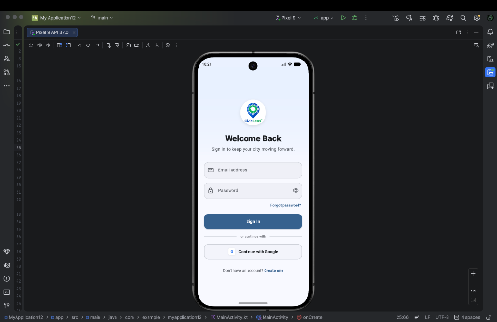
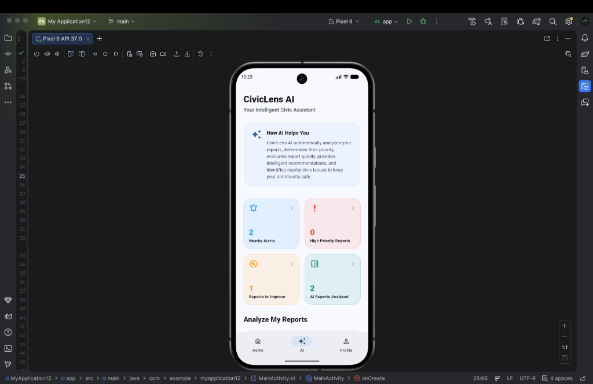
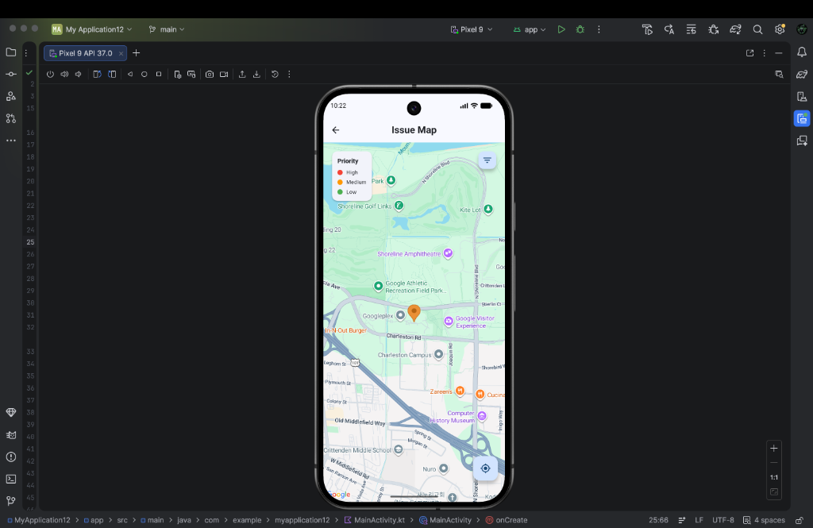

# CivicLens AI 🗺️🤖

An AI-powered civic engagement application designed for modern communities. CivicLens AI empowers citizens to report local municipal issues (like potholes, broken streetlights, or trash accumulation) and leverages advanced Google AI/Gemini technologies to categorize, assess, prioritize, and route reports to the appropriate city departments automatically.

---

## 🎯 Project Overview

CivicLens AI bridges the gap between citizens and local government. By transforming how issues are reported and processed, the app ensures critical infrastructure problems are resolved efficiently. The backend automatically evaluates reports, calculates quality scores, evaluates duplicate probabilities, and alerts nearby users of hazards.

---

## 🎨 Screenshots

| Login Screen | AI Insights Dashboard | Interactive Issue Map |
| :---: | :---: | :---: |
|  |  |  |

---

## ✨ Core Features

*   **📱 Material 3 UI Overhaul**: Sleek dark/light theme, custom glassmorphism backdrops, responsive form factor layouts (tested for small phones, large phones, and tablets).
*   **📍 Interactive Google Maps Integration**: View nearby civic issues in real-time, get directions, and check local alert zones.
*   **🤖 Gemini AI Report Analysis**:
    *   **Auto-Priority Classification**: Determines whether reports are `High`, `Medium`, or `Low` priority.
    *   **Quality Scoring & Recommendations**: Scores reports based on completeness (description length, photo, location) and suggests instant improvement steps.
    *   **Department Routing**: Routes issues automatically to Public Works, Sanitation, Traffic, or Utilities.
    *   **Duplication Check**: Calculates duplicate probability using proximity and keyword similarity.
*   **🔔 Real-Time Nearby Alerts**: Flags active issues within 5 km of the user's current GPS location.
*   **📸 Media Management**: Seamless image and video uploads powered by Cloudinary.

---

## 🛠️ Tech Stack & Google Technologies

### Frontend & Core
*   **Frontend**: Flutter & Dart (Cross-platform application framework).
*   **Design**: Material 3 (Design system for animations, inputs, and structure).

### Google Technologies Used
*   **Firebase Authentication**: Secure email/password login and one-click Google Sign-In.
*   **Cloud Firestore**: Real-time NoSQL database.
*   **Firebase AI / Gemini API**: Multi-modal AI analysis of issue descriptions, locations, and media.
*   **Google Maps Flutter**: Map overlays, custom markers, and location selections.
*   **Geolocator**: High-precision client-side GPS location tracking.

### Media & Backend Integrations
*   **Cloudinary API**: High-resolution image/video host.

---

## 📂 Project Structure

```
lib/
├── firebase_options.dart      # Auto-generated Firebase configurations
├── main.dart                  # Application entry point & AuthGate
├── models/
│   └── issue_model.dart       # Issue representation schema
├── screens/
│   ├── about_screen.dart               # Info and About CivicLens AI
│   ├── ai_analysed_reports_screen.dart # Directory of all AI analyzed issues
│   ├── ai_report_analysis_screen.dart  # Detailed AI metrics and scores
│   ├── contact_us_screen.dart          # Civic feedback forms
│   ├── edit_profile_screen.dart        # Account settings
│   ├── high_priority_reports_screen.dart# Fast lane for emergency issues
│   ├── home_screen.dart                # Multi-tab Dashboard (Home, AI, Profile)
│   ├── login_screen.dart               # Redesigned Material 3 Login
│   ├── map_screen.dart                 # Interactive Google Map view
│   ├── my_reports_screen.dart          # Personal issue tracker
│   ├── nearby_alerts_screen.dart       # GPS-based safety alerts
│   ├── privacy_policy_screen.dart      # Policy guidelines
│   ├── report_details_screen.dart      # Complete details of a single report
│   ├── report_issue_screen.dart        # Multi-step editor/creator
│   ├── reports_to_improve_screen.dart  # Quality optimizer & checklist
│   └── signup_screen.dart              # Onboarding / Signup
├── services/
│   ├── ai_service.dart         # Interface to Firebase AI / Gemini API
│   ├── auth_service.dart       # Firebase Authentication wrapper
│   ├── cloudinary_service.dart # Upload pipeline for images/videos
│   ├── issue_service.dart      # Firestore database service
│   └── location_service.dart   # GPS coordinates and permissions
└── widgets/
    └── civiclens_logo.dart    # Custom brand logo widget
```

---

## 🚀 Getting Started

### Prerequisites
Make sure you have the following installed on your machine:
*   [Flutter SDK (v3.12.2 or higher)](https://docs.flutter.dev/get-started/install)
*   [Dart SDK](https://dart.dev/get-started)
*   Android Studio / Xcode (for device emulation)

---

### Installation & Setup

1.  **Clone the Repository**:
    ```bash
    git clone <repository_url>
    cd civiclens_ai
    ```

2.  **Install Dependencies**:
    ```bash
    flutter pub get
    ```

3.  **Run the Project (Debug)**:
    ```bash
    flutter run
    ```

4.  **Build a Release APK**:
    ```bash
    flutter build apk --release
    ```

---

## 🔥 Firebase & AI Integration Guide

### 1. Firebase Project Setup
1.  Go to the [Firebase Console](https://console.firebase.google.com/) and click **Add Project**.
2.  Enable **Authentication** and activate the **Email/Password** and **Google** providers.
3.  Create a **Cloud Firestore** database in test mode.
4.  Install the Firebase CLI and login:
    ```bash
    npm install -g firebase-tools
    firebase login
    ```
5.  Initialize FlutterFire in your project:
    ```bash
    dart pub global activate flutterfire_cli
    flutterfire configure
    ```
6.  This will generate [lib/firebase_options.dart](file:///Users/farhan/Documents/civiclens_ai/lib/firebase_options.dart) and configure Android/iOS client configurations.

### 2. Gemini AI / Firebase AI Configuration
1.  Enable the **Gemini API** within Google AI Studio or Google Cloud Console.
2.  Follow the instructions in the Firebase AI documentation to add the Gemini API dependency.
3.  Make sure your project has a valid Gemini API Key configured in your environment or via Google Cloud service configurations to allow client-side multi-modal inference inside [lib/services/ai_service.dart](file:///Users/farhan/Documents/civiclens_ai/lib/services/ai_service.dart).

---

## 💡 Future Improvements

*   **📈 Machine Learning Model refinement**: Train specialized computer vision models to identify potholes or damage directly from photos before sending to Gemini.
*   **🔔 Push Notifications**: Notify users when their reported issue changes state (e.g., `In Progress` -> `Resolved`).
*   **📦 Offline Mode**: Cache reported issues locally using Hive/Sqflite and upload when a connection is restored.
*   **🔗 Government CRM Integration**: API bridges to open-source municipal platforms like Open311.

---

## 👥 Contributors

*   **Farhan** - Lead Developer & Hackathon Participant
*   **Antigravity** - Google DeepMind AI Coding Companion

---

## 📄 License

This project is licensed under the MIT License - see the [LICENSE](LICENSE) file for details.
