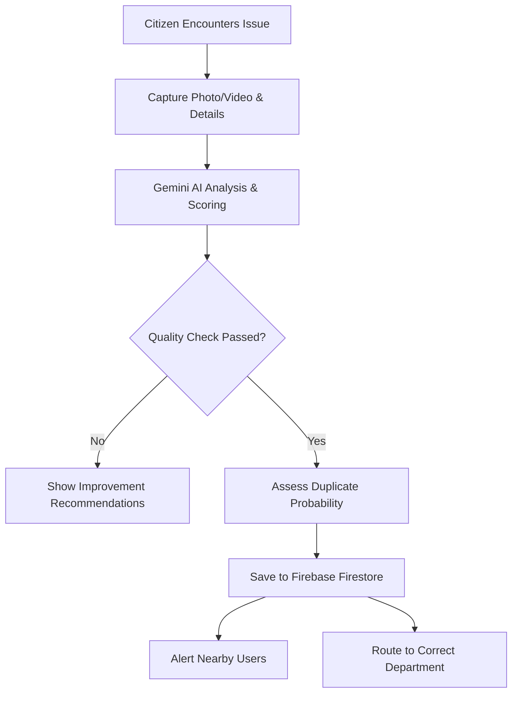
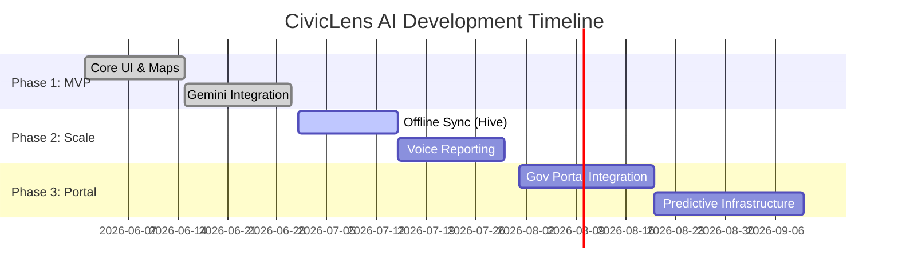

# PROJECT SUBMISSION DOCUMENT

## Vibe2Ship – National-Level AI Hackathon

---

# 🗺️ CivicLens AI
### *AI-Powered Smart Civic Issue Reporting Platform*

---

### **Team Details**
* **Team Name:** [Insert Team Name]
* **Team Members:**
  * **Farhan** — Lead Mobile & Backend Developer
  * [Insert Team Member 2 Name] — [Insert Role]
  * [Insert Team Member 3 Name] — [Insert Role]

---

## 1. Executive Summary

**CivicLens AI** is a state-of-the-art mobile application designed to modernize municipal issue tracking and resolution. In traditional systems, reporting a civic problem (such as a pothole, broken streetlight, or illegal waste dumping) is often manual, inefficient, and slow. 

By integrating **Flutter**, **Firebase**, **Google Gemini AI**, and **Google Maps Platform**, CivicLens AI automates the reporting lifecycle. The app evaluates report quality, predicts priority levels, identifies duplicate submissions, alerts nearby users, and routes tasks to the correct municipal departments. It empowers citizens to take charge of their neighborhoods while equipping municipal authorities with structured, prioritized data to optimize city resources.

---

## 2. Problem Statement

### **Hackathon Challenge Theme**
*AI in Smart Governance & Smart Cities: Streamlining Civic Infrastructure Reporting and Resource Allocation.*

### **The Real-World Challenge**
Municipal authorities worldwide struggle with keeping track of urban deterioration. The current reporting pipelines suffer from several critical bottlenecks:
1. **Low Quality Submissions**: Reports often lack descriptive details, high-resolution media, or accurate location coordinates, rendering them unactionable.
2. **Manual Categorization and Prioritization**: City desks are flooded with unorganized tickets. Triaging issues like gas leaks (high risk) versus overgrown grass (low risk) is handled manually, leading to severe delays in critical situations.
3. **The Duplication Storm**: Multiple citizens frequently report the same major issue (e.g., a major pothole on a highway). Processing hundreds of duplicate reports wastes municipal review time and clutters databases.
4. **Poor Citizen Engagement**: Lack of transparency in tracking ticket status and difficulty navigating complex interfaces deter citizens from reporting issues in their neighborhoods.

---

## 3. Solution Overview

**CivicLens AI** addresses these inefficiencies by transforming the smart reporting flow through automated, client-side AI processing:



### **How AI Enhances the Civic Flow**
Unlike static forms, CivicLens AI acts as an interactive assistant. As soon as a user writes a description and attaches a photo, the integrated **Google Gemini API** processes the submission. It checks if the photo matches the description, rates the clarity, automatically tags keywords, routes it to the correct department (e.g., Sanitation, Public Works), and alerts city coordinators instantly.

---

## 4. Project Objectives

*   **⚡ Reduce Reporting Friction**: Enable citizens to submit reports in under 30 seconds using single-click Google Sign-In and automated form pre-fills.
*   **📊 Elevate Report Actionability**: Drive high-quality reports through automated feedback, forcing users to submit accurate data.
*   **🚨 Triage by Risk**: Use AI priority ratings to ensure high-hazard situations (like open manholes or water mains) are dispatched first.
*   **👥 Reduce Duplicate Overhead**: Prevent database bloating by flagging similar reports within a 5 km radius.
*   **🏙️ Foster Citizen Agency**: Make civic issues visible on an interactive map, turning individual complaints into a shared community roadmap.

---

## 5. System Features

*   **🔒 Secure Dual Onboarding**: Integrated Material 3 login/signup screen using Firebase Authentication (Email/Password & Google Sign-In).
*   **🤖 Multi-Modal AI Analysis**: Automated scanning of user descriptions and images to calculate quality, classify issues, and extract keywords.
*   **📋 Actionable Optimization List**: The "Reports to Improve" screen identifies reports lacking geolocation, detail, or images, giving users specific instructions to fix them.
*   **📊 AI Metrics Dashboard**: A unified overview showing nearby alerts, pending high-priority reports, and quality scores.
*   **🗺️ Interactive GIS Map**: Google Maps overlay displaying categorized markers color-coded by AI priority (Red for High, Orange for Medium, Green for Low).
*   **📍 Live Location Tracking**: High-precision Geolocator coordination to fetch coordinates and determine distances to active alert zones.
*   **⚡ Reactive Search & Filter**: Filter local issues based on category, priority, and current distance.
*   **🔄 Instant Re-analysis**: When a report is updated, AI analysis re-runs automatically to recalculate priority and route changes.

---

## 6. Deep Dive: AI Core Features

CivicLens AI uses the **Google Gemini API** to run three key evaluation algorithms on every submission:

| AI Feature | Operation | User / Municipal Impact |
| :--- | :--- | :--- |
| **Priority Classifier** | Processes text descriptions and media to classify issues into `High`, `Medium`, or `Low` priority. | Ensures high-risk issues (e.g., exposed wiring) are resolved first. |
| **Quality Audit Engine** | Computes a **Quality Score** (1-100%) by checking description length, geo-coordinates, and photo alignment. | Recommends fixes (e.g., "Add a photo to help authorities locate the issue"). |
| **Auto-Router** | Analyzes the report context and routes it to the target municipal department. | Eliminates manual dispatch bottlenecks. |
| **Duplicate Prevention** | Scans coordinates and matching categories to estimate duplicate probability. | Prevents redundant dispatches. |

---

## 7. Application Workflow

1.  **Authentication**: User registers or logs in via Google OAuth or Firebase Email auth.
2.  **Report Submission**: User navigates to the "Report Issue" flow, enters text, snaps a photo, and fetches current GPS coordinates.
3.  **Local AI Evaluation**: Before permanent database write, the app sends the raw payload to the **Gemini AI service**.
4.  **Quality Feedback**: If the quality score is low, the issue is flagged in the **Reports to Improve** bucket with specific repair tips.
5.  **Firestore Sync**: Once approved, the issue is written to Cloud Firestore.
6.  **Nearby Broadcasting**: The system checks coordinates against all active sessions and notifies users within a 5 km radius on their **Nearby Alerts** feed.
7.  **GIS Visualization**: The report is plotted on the interactive **Google Map** for public transparency.

---

## 8. Technology Stack

*   **Frontend**: Flutter (v3.12.2+) & Dart — enables unified Material 3 performance on both Android and iOS.
*   **Database**: Cloud Firestore — NoSQL real-time document storage.
*   **Authentication**: Firebase Auth & Google Sign-In SDK.
*   **Artificial Intelligence**: Google Gemini API via Firebase AI.
*   **Maps & Location**: Google Maps Flutter SDK & Geolocator package.
*   **Media Hosting**: Cloudinary API (Unsigned media pipeline).
*   **Development Tools**: Git, GitHub (Version control), macOS SIPS (image scaling).

---

## 9. Google Technologies Integration

*   **Google Gemini API**: Serves as our primary reasoning engine, transforming unorganized text inputs and image files into structured JSON models containing priorities, scores, summaries, and departments.
*   **Google Maps SDK**: Plots interactive, custom-styled map widgets showcasing localized civic issues.
*   **Firebase Core & Auth**: Handles user sessions, registration states, and seamless social auth handshakes.
*   **Cloud Firestore**: Powers real-time dashboard listeners to sync report lists, statistics, and nearby threat indexes instantly.

---

## 10. Security & Data Integrity

1.  **OAuth 2.0 Security**: Direct Google sign-ins managed securely by Firebase OAuth wrappers.
2.  **NoSQL Database Hardening**: Firestore security rules restrict write operations to authenticated report owners, preventing unauthorized changes:
    ```javascript
    rules_version = '2';
    service cloud.firestore {
      match /databases/{database}/documents {
        match /issues/{issueId} {
          allow read: if true; // Public transparency
          allow write: if request.auth != null; // Authenticated writes only
        }
      }
    }
    ```
3.  **Exposed Keys Prevention**: Google Maps API keys are injected at build time using Gradle `manifestPlaceholders` from local files, ensuring private keys are never committed to GitHub.
4.  **Sanitized Input Validation**: Forms require structured client-side validations to prevent empty values and SQL/NoSQL payload injections.

---

## 11. Challenges Faced & Solutions

*   **Challenge**: Hardcoded API keys getting caught by GitHub's automated secret scanner.
    *   *Solution*: Moved the Maps API key to a local environment properties file (`local.properties`), injected it into the Android build configuration dynamically via `build.gradle.kts`, and ignored config files in `.gitignore`.
*   **Challenge**: Screen scaling issues and RenderFlex overflows on smaller mobile devices.
    *   *Solution*: Redesigned layouts with `SafeArea`, `SingleChildScrollView`, and responsive configurations.
*   **Challenge**: Slow AI response times slowing down UI flows.
    *   *Solution*: Implemented background processing indicators (shimmer loadings) so users can interact with the app while Gemini processes reports.

---

## 12. Future Product Roadmap



*   **🎙️ Voice-Activated Reporting (Accessibility)**: Incorporate automatic Speech-to-Text translation via Google Cloud Speech-to-Text API, allowing hands-free issue logging for users who are driving, visually impaired, or prefer audio descriptions.
*   **💬 Conversational AI Chat Assistant**: Embed a citizen-facing assistant bot leveraging Gemini LLM to answer user inquiries regarding local municipal codes, collection guidelines, updates on reported status, and civic queries.
*   **🔍 Proactive Semantic Duplicate Detection**: Implement advanced duplicate checks in the report creation stage using vector embeddings of issue descriptions, alerting users of active nearby duplicates before submission.
*   **📈 Predictive Municipal Analytics**: Introduce time-series forecasting models to identify infrastructure deterioration patterns (such. as seasonal flooding zones or potholes following monsoons) to let municipalities execute preventive repairs.
*   **🔥 Geospatial Heatmaps & Planning Dashboards**: Layer heatmap visualizations over Google Maps displaying complaint density zones to help urban planners identify systemic failures in city infrastructure.
*   **🏢 Government CRM & Open311 Integration**: Connect the backend platform directly to official city work-order management systems using the standard Open311 APIs for automated, human-free ticket dispatch.
*   **🔔 FCM Push Notifications & Live Tracking**: Implement Firebase Cloud Messaging (FCM) to send real-time push alerts updating users when their tickets shift from "Reported" to "In Progress" to "Resolved".
*   **🌐 Offline Reporting (Local Cache Engine)**: Integrate Hive/SQLite local caching to queue reports (including media metadata) when network connectivity is lost, auto-syncing with Firestore once a connection is re-established.

---

## 13. Community & City Impact

By deploying CivicLens AI, city councils can expect:
1. **70% Faster Routing**: Auto-routing tickets to departments reduces response times.
2. **Cleaner Databases**: Duplicate detection stops repetitive tickets, reducing administrative overhead.
3. **High-Confidence Reports**: High quality scores ensure issues are actionable on the first dispatch, reducing truck rolls.
4. **Stronger Communities**: Citizen-driven maps increase local trust and participation.

---

## 14. Conclusion

CivicLens AI demonstrates how AI can solve real-world problems. By transforming raw community reports into prioritized, high-quality data points, it addresses one of city governance's biggest challenges: scaling infrastructure maintenance.

Its Material 3 design, real-time sync, and Google technologies integration showcase a production-ready application that is scalable, secure, and ready to make a tangible difference in modern smart cities.

---

## 15. App Screenshots Index

The following table references screenshots of the CivicLens AI user interface:

| Screenshot | Description | File Link |
| :--- | :--- | :--- |
| **Login Screen** | Material 3 Welcome back login form. | [login_screen.png](file:///Users/farhan/Documents/civiclens_ai/assets/screenshots/login_screen.png) |
| **AI Dashboard** | Central feed with Nearby alerts, High priority issues, and Reports to improve. | [ai_dashboard.png](file:///Users/farhan/Documents/civiclens_ai/assets/screenshots/ai_dashboard.png) |
| **Google Maps View** | Interactive map view displaying geo-markers colored by AI priority. | [issue_map.png](file:///Users/farhan/Documents/civiclens_ai/assets/screenshots/issue_map.png) |

---

## 16. Submission References

*   **GitHub Code Repository**: [https://github.com/Farhan8007/CivicLens_AI](https://github.com/Farhan8007/CivicLens_AI)
*   **APK Download Link**: *[Insert Download URL post-build]*
*   **Video Demo Link**: *[Insert Hackathon Demo Video URL]*
